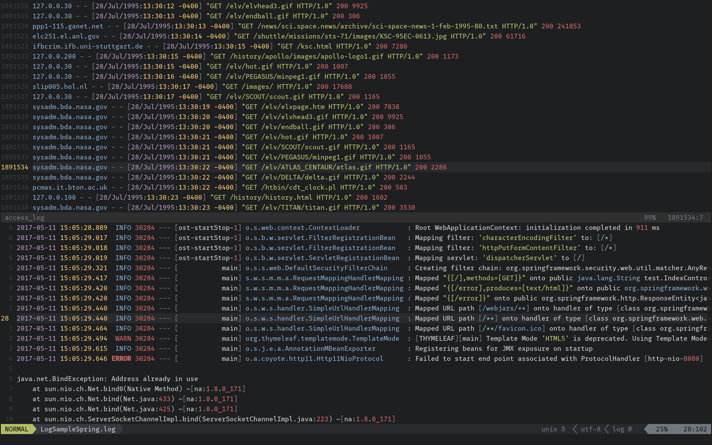

# Vim Log Highlighting



## Overview

A VIM plugin that aims at making it easier for me to analyze LOG files generated by our embedded system. It does so by using highlighting of keywords and elements, and shortcuts for quick navigation in logfile.

A sample log entry from the system might look like:
```
[2024-01-30-16:10:39][370311013][DIAG vdmd][INFO] [DmEv][NotifyActivityStatusChange] Notify activity status: kInactive of conversation: 0 towards all connected applications. [state_change_notifier.cpp:125]
```

Some of the highlighted elements are:
- Dates and times
- Common log level keywords like ERROR, INFO, DEBUG
- Numbers, booleans and strings
- URLs and file paths
- IP and MAC addresses


## Installation

### [VimPlug](https://github.com/junegunn/vim-plug)

Add `Plug '6feet5/vim-log-highlighting'` to your `~/.vimrc` and run `PlugInstall`.

### [Vundle](https://github.com/gmarik/Vundle.vim)

Add `Plugin '6feet5/vim-log-highlighting'` to your `~/.vimrc` and run `PluginInstall`.

### [Pathogen](https://github.com/tpope/vim-pathogen)

    $ git clone https://github.com/6feet5/vim-log-highlighting ~/.vim/bundle/vim-log-highlighting

### Manual Install

Copy the contents of the `ftdetect` and `syntax` folders in their respective `~/.vim/\*` counterparts.


## Configuration

Once installed, the syntax highlighting will be enabled by default for files ending with `.log` and `_log` suffixes.

By default only uppercase keywords are recognized as level indicators in the log files.
You can add additional log level keywords using the standard VIM syntax functions, for example by adding this to your `.vimrc` file:

```viml
" Add custom level identifiers
au rc Syntax log syn keyword logLevelError MY_CUSTOM_ERROR_KEYWORD
```

Likewise you can disable highlighting for elements you don't need:

```viml
" Remove highlighting for URLs
au rc Syntax log syn clear logUrl
```


## Credits

* [vim-log-highlight](https://github.com/MTDL9/vim-log-highlighting) by MTDL9
* [Learn Vim Script the Hard Way](https://learnvimscriptthehardway.stevelosh.com/) by Steve Losh
